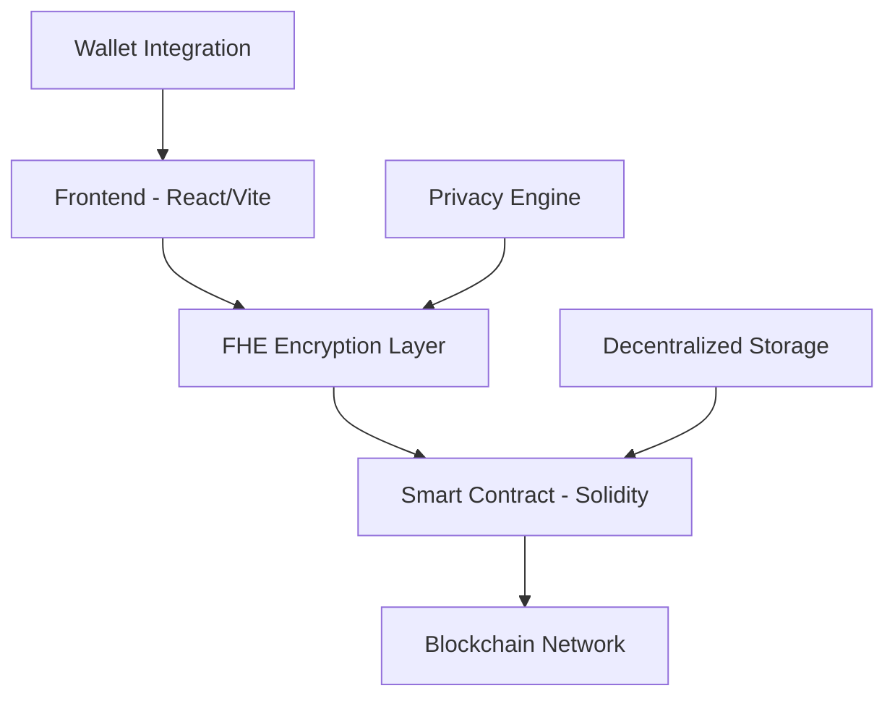

# 🛡️ Confidential Bounty Board
> *Privacy-First Decentralized Task Management Platform*

[](https://confidential-bounty-board.vercel.app)
[](https://github.com/Willia9g/confidential-bounty-board)
[](LICENSE)

---

## 🎯 What is Confidential Bounty Board?

Confidential Bounty Board revolutionizes the way we handle decentralized task management by leveraging **Fully Homomorphic Encryption (FHE)** technology. This platform ensures that sensitive bounty information, applicant data, and transaction details remain completely private while maintaining full functionality.

### 🔐 Core Privacy Features

| Feature | Description | Benefit |
|---------|-------------|---------|
| **🔒 Encrypted Bounties** | All bounty details encrypted with FHE | Complete privacy protection |
| **👤 Anonymous Applications** | Submit applications without revealing identity | True anonymity |
| **💰 Private Transactions** | Financial data encrypted end-to-end | Secure monetary operations |
| **🛡️ Zero-Knowledge Proofs** | Verify eligibility without exposing data | Privacy-preserving validation |

---

## 🚀 Quick Start Guide

### Prerequisites Checklist
- [ ] Node.js ≥ 18.0.0
- [ ] npm/yarn package manager
- [ ] Git version control
- [ ] Web3 wallet (MetaMask, WalletConnect)

### Installation Steps

```bash
# 1️⃣ Clone the repository
git clone https://github.com/Willia9g/confidential-bounty-board.git
cd confidential-bounty-board

# 2️⃣ Install dependencies
npm install

# 3️⃣ Environment setup
cp .env.example .env
# Configure your environment variables

# 4️⃣ Launch development server
npm run dev
```

### 🔧 Environment Configuration

Create your `.env` file with these essential variables:

```env
# WalletConnect Configuration
VITE_WALLETCONNECT_PROJECT_ID=your_project_id_here

# Smart Contract Details
VITE_CONTRACT_ADDRESS=0x...

# Blockchain Network
VITE_RPC_URL=https://your-rpc-endpoint.com
```

---

## 🏗️ Architecture Overview



### 🛠️ Technology Stack

#### Frontend Technologies
- **⚡ Vite** - Lightning-fast build tool
- **⚛️ React 18** - Modern UI framework
- **📘 TypeScript** - Type-safe development
- **🎨 Tailwind CSS** - Utility-first styling
- **🧩 shadcn/ui** - Beautiful component library

#### Blockchain & Privacy
- **🔐 Zama FHE** - Fully Homomorphic Encryption
- **⛓️ Solidity** - Smart contract development
- **🔗 WalletConnect** - Multi-wallet integration
- **🌐 Ethereum** - Decentralized network

---

## 📋 Smart Contract Features

Our Solidity smart contract implements:

### Core Functions
```solidity
// Create encrypted bounty
function createBounty(bytes calldata encryptedData) external;

// Submit private application
function submitApplication(uint256 bountyId, bytes calldata encryptedApp) external;

// Verify completion with zero-knowledge
function verifyCompletion(uint256 bountyId, bytes calldata proof) external;
```

### Security Features
- 🔒 **FHE Integration** - All sensitive data encrypted
- 🛡️ **Access Control** - Role-based permissions
- 🔍 **Audit Trail** - Immutable transaction history
- ⚡ **Gas Optimization** - Efficient contract execution

---

## 🚀 Deployment Options

### Option 1: Vercel (Recommended)
```bash
# Connect GitHub repo to Vercel
# Configure environment variables
# Auto-deploy on main branch push
```

### Option 2: Manual Deployment
```bash
npm run build
# Deploy dist/ folder to your hosting provider
```

### Option 3: Docker Deployment
```bash
docker build -t confidential-bounty-board .
docker run -p 3000:3000 confidential-bounty-board
```

---

## 🤝 Contributing Guidelines

We welcome contributions! Here's how to get started:

### Development Workflow
1. 🍴 **Fork** the repository
2. 🌿 **Create** a feature branch (`git checkout -b feature/amazing-feature`)
3. 💻 **Make** your changes
4. ✅ **Test** thoroughly
5. 📝 **Commit** with clear messages
6. 🚀 **Push** to your branch
7. 🔄 **Submit** a pull request

### Code Standards
- Follow TypeScript best practices
- Write comprehensive tests
- Update documentation
- Ensure FHE compliance

---

## 📊 Project Statistics


---

## 🔗 Important Links

| Resource | Link | Description |
|----------|------|-------------|
| 🌐 **Live Demo** | [confidential-bounty-board.vercel.app](https://confidential-bounty-board.vercel.app) | Try the platform |
| 📚 **Repository** | [github.com/Willia9g/confidential-bounty-board](https://github.com/Willia9g/confidential-bounty-board) | Source code |
| 🐛 **Issues** | [Report Bug](https://github.com/Willia9g/confidential-bounty-board/issues) | Found a bug? |
| 💡 **Feature Requests** | [Request Feature](https://github.com/Willia9g/confidential-bounty-board/issues/new) | Have an idea? |
| 📖 **Documentation** | [Wiki](https://github.com/Willia9g/confidential-bounty-board/wiki) | Detailed docs |

---

## 📄 License & Legal

This project is licensed under the **MIT License** - see the [LICENSE](LICENSE) file for details.

### Privacy Notice
- 🔐 All data is encrypted using FHE technology
- 🛡️ No personal information is stored in plain text
- 🔍 Zero-knowledge proofs ensure privacy
- ⚖️ Compliant with privacy regulations

---

## 🙏 Acknowledgments

- **Zama** for FHE technology
- **Ethereum Foundation** for blockchain infrastructure
- **Open Source Community** for amazing tools and libraries

---

<div align="center">

**Built with ❤️ by [Willia9g](https://github.com/Willia9g)**

*Empowering privacy in decentralized applications*

[⬆️ Back to Top](#-confidential-bounty-board)

</div>